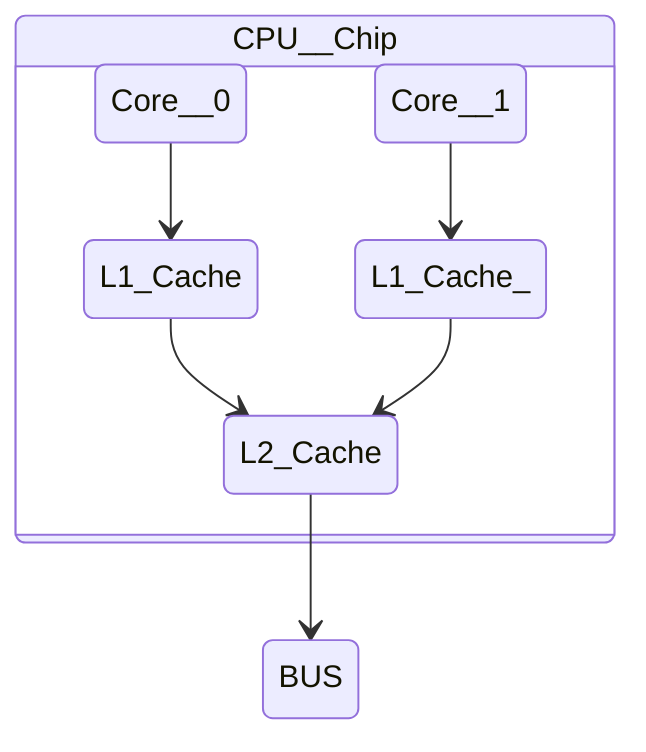

# Vim \_ Assembly Highlight Syntax

```

:set ft=nasm  " assembly highlight syntax

```

<br>

# x86-x64 명령어 레퍼런스 읽는 법

https://modoocode.com/316

# The Go tools for Windows + Assembler

http://godevtool.com/

<br>

# 1.4.4.1 YASM References

http://yasm.tortall.net/

1.4.4.1 YASM References
The YASM assembler is an open source assembler commonly available on Linux-based
systems.
The YASM references are as follows:

- Yasm Web Site http://yasm.tortall.net/
- Yasm Documentation http://yasm.tortall.net/Guide.html

  Additional information regarding YASM may be available a number of assembly
  language sites and can be found through an Internet search.

# 1.4.4.2 DDD Debugger References

The DDD debugger is an open source debugger capable of supporting assembly
language.

- DDD Web Site https://www.gnu.org/software/ddd/
- DDD Documentation https://www.gnu.org/software/ddd/manual/

Additional information regarding DDD may be at a number of assembly language sites
and can be found through an Internet search.

<br>

# Assembly Language

https://github.com/EbookFoundation/free-programming-books/blob/main/books/free-programming-books-langs.md#non-x86

# x86 Assembly : Hello World

https://youtu.be/HgEGAaYdABA

# x86_64_Assembly_my_project

- x86_64_Assembly Language Programming with Ubuntu

http://www.egr.unlv.edu/~ed/assembly64.pdf

# apt install(Linux OS)

```
$ sudo apt install nasm
Reading package lists... Done
Building dependency tree... Done
Reading state information... Done
The following NEW packages will be installed:
  nasm
0 upgraded, 1 newly installed, 0 to remove and 11 not upgraded.
Need to get 375 kB of archives.
After this operation, 3,345 kB of additional disk space will be used.
Get:1 http://us.archive.ubuntu.com/ubuntu jammy/universe amd64 nasm amd64 2.15.05-1 [375 kB]
Fetched 375 kB in 2s (217 kB/s)
Selecting previously unselected package nasm.
(Reading database ... 263485 files and directories currently installed.)
Preparing to unpack .../nasm_2.15.05-1_amd64.deb ...
Unpacking nasm (2.15.05-1) ...
Setting up nasm (2.15.05-1) ...
Processing triggers for man-db (2.10.2-1) ...
```

# ASM Sample

```
$ nasm -f elf32 -o hello.o hello.asm

$ ls
hello.asm  hello.o

$ ld -m elf_i386 -o hello hello.o

$ ls
hello  hello.asm  hello.o

$ ./hello
Hello World!

```

# ASM hello.asm

```asm
; World World x86_64 Intel Cpu Assembly
; hello.asm

global _start

section     .text:

_start:
    mov eax, 0x4                    ; use the write syscall
    mov ebx, 1                      ; use stdout as the fd
    mov ecx, message                ; use the message as the buffer
    mov edx, message_length         ; and supply the length
    int 0x80                        ; invoke the syscall

    ; now gracefully exit

    mov eax, 0x1
    mov ebx, 0
    int 0x80


section     .data:
    message: db     "Hello World!", 0xA
    message_length equ $-message


```

# Windows OS

```
choco install nasm

```

- This package uses the official nasm Windows installer, which doesn't add nasm to PATH. You may voice out your request in the nasm issue tracker, in which there is an existing issue filed

- PATH설정해줘야함. 나 같은 경우는
  "C:\Program Files\NASM"
  여기 PATH 설정함.

[https://community.chocolatey.org/packages/nasm](https://community.chocolatey.org/packages/nasm)

<br>

<hr>

# Rust Languages & Assembly<a href="https://www.rust-lang.org/"></a>

<br>

# RustLang inline-assembly

https://doc.rust-lang.org/reference/inline-assembly.html

https://doc.rust-lang.org/rust-by-example/unsafe/asm.html

<br>

## Rust ~~~~~~~~~ ~~~~~~~

<br>

<hr>

# Assembly 기초 basic
<a href="https://en.wikipedia.org/wiki/Assembly_language"></a>

# Bootsector Game From Scratch - Space Invaders (x86 asm) Game만들기(Assembly로)

[https://youtu.be/TVvTDjMph1M](https://youtu.be/TVvTDjMph1M)

<br>

# ASCII Table

https://www.asciitable.com/

```
$ python

Python 3.11.0 (main, Oct 24 2022, 18:26:48) [MSC v.1933 64 bit (AMD64)] on win32
Type "help", "copyright", "credits" or "license" for more information.

>>> 0x0a
10

>>> chr(0x0a)
'\n'

>>>


```

<br>

<hr>

====================================================

# x86_64_Assembly Language Programming with Ubuntu<a href="https://en.wikipedia.org/wiki/Assembly_language"></a>

# Data Storage Sizes(page 8.)

<table border="1">
    <tr>
    <td colspan="3" align="center">Data Storage Sizes</td>
    </tr>
    <tr align="center">
        <td>Storage</td>
        <td>Size(bits)</td>
        <td>Size(bytes)</td>
    </tr>
    <tr align="center">
        <td>Byte</td>
        <td>8-bits</td>
        <td>1 byte</td>
    </tr>
    <tr align="center">
        <td>Word</td>
        <td>16-bits</td>
        <td>2 bytes</td>
    </tr>
    <tr align="center">
        <td>Double-word</td>
        <td>32-bits</td>
        <td>4 bytes</td>
    </tr>
    <tr align="center">
        <td>Quadword</td>
        <td>64-bits</td>
        <td>8 bytes</td>
    </tr>
    <tr align="center">
        <td>Double quadword</td>
        <td>128-bits</td>
        <td>16 bytes</td>
    </tr>
</table>

http://www.egr.unlv.edu/~ed/assembly64.pdf

<table border="1">
    <tr>
    <td colspan="3" align="center">Data Storage Sizes(page9.)<br>C/C++ declarations are mapped as follows:</td>
    </tr>
    <tr align="center">
        <td>C/C++<br>Declaration</td>
        <td>Storage</td>
        <td>Size(bits)</td>
        <td>Size(bytes)</td>
    </tr>
    <tr align="center">
        <td>char</td>
        <td>Byte</td>
        <td>8-bits</td>
        <td>1 byte</td>
    </tr>
    <tr align="center">
        <td>Word</td>
        <td>16-bits</td>
        <td>2 bytes</td>
    </tr>
    <tr align="center">
        <td>Double-word</td>
        <td>32-bits</td>
        <td>4 bytes</td>
    </tr>
    <tr align="center">
        <td>Quadword</td>
        <td>64-bits</td>
        <td>8 bytes</td>
    </tr>
    <tr align="center">
        <td>Double quadword</td>
        <td>128-bits</td>
        <td>16 bytes</td>
    </tr>
</table>

<br>

# General Purpose Registers(GPRs) page 10

<table border="1">
    <tr>
    <td colspan="8" align="center">rax<br><-- 64 bits --></td>
    </tr>
    <tr align="center">
        <td>8bit</td>
        <td>8bit</td>
        <td>8bit</td>
        <td>8bit</td>
        <td colspan="4" align="center">eax<br>(Lowest 32-bits<br><----------------    ----------------------></td>
        </tr>
    </tr>
    <tr align="center">
        <td>8bit</td>
        <td>8bit</td>
        <td>8bit</td>
        <td>8bit</td>
        <td>8bit</td>
        <td>8bit</td>
        <td colspan="2", align="center"><---    ax     ---><br>Lowest 16-bits</td>
    </tr>
    <tr align="center">
        <td>8bit</td>
        <td>8bit</td>
        <td>8bit</td>
        <td>8bit</td>
        <td>8bit</td>
        <td>8bit</td>
        <td>ah<br><-- 8-bits --></td>
        <td>al<br><-- 8-bits --></td>
    </tr>
</table>

<br>

<table border="1">
    <tr>
    <td colspan="4" align="center">General Purpose Registers(GPRs)</td>
    </tr>
    <tr align="center">
        <td>64-bit register</td>
        <td>Lowest<br>32-bits</td>
        <td>Lowest<br>16-bits</td>
        <td>Lowest<br>8-bits</td>
    </tr>
    <tr align="center">
        <td>rax</td>
        <td>eax</td>
        <td>ax</td>
        <td>al</td>
    </tr>
    <tr align="center">
        <td>rbx</td>
        <td>ebx</td>
        <td>bx</td>
        <td>bl</td>
    </tr>
    <tr align="center">
        <td>rcx</td>
        <td>ecx</td>
        <td>cx</td>
        <td>cl</td>
    </tr>
    <tr align="center">
        <td>rdx</td>
        <td>edx</td>
        <td>dx</td>
        <td>dl</td>
    </tr>
    <tr align="center">
        <td>rsi</td>
        <td>esi</td>
        <td>si</td>
        <td>sil</td>
    </tr>
    <tr align="center">
        <td>rdi</td>
        <td>edi</td>
        <td>di</td>
        <td>dil</td>
    </tr>
    <tr align="center">
        <td>rbp</td>
        <td>ebp</td>
        <td>bp</td>
        <td>bpl</td>
    </tr>
    <tr align="center">
        <td>rsp</td>
        <td>esp</td>
        <td>sp</td>
        <td>spl</td>
    </tr>
    <tr align="center">
        <td>r8</td>
        <td>r8d</td>
        <td>r8w</td>
        <td>r8b</td>
    </tr>
    <tr align="center">
        <td>r9</td>
        <td>r9d</td>
        <td>r9w</td>
        <td>r9b</td>
    </tr>
    <tr align="center">
        <td>r10</td>
        <td>r10d</td>
        <td>r10w</td>
        <td>r10b</td>
    </tr>
    <tr align="center">
        <td>r11</td>
        <td>r11d</td>
        <td>r11w</td>
        <td>r11b</td>
    </tr>
    <tr align="center">
        <td>r12</td>
        <td>r12d</td>
        <td>r12w</td>
        <td>r12b</td>
    </tr>
    <tr align="center">
        <td>r13</td>
        <td>r13d</td>
        <td>r13w</td>
        <td>r13b</td>
    </tr>
    <tr align="center">
        <td>r14</td>
        <td>r14d</td>
        <td>r14w</td>
        <td>r14b</td>
    </tr>
    <tr align="center">
        <td>r15</td>
        <td>r15d</td>
        <td>r15w</td>
        <td>r15b</td>
    </tr>
</table>

http://www.egr.unlv.edu/~ed/assembly64.pdf

<br>

# Stack Pointer Register (RSP)

- Stack Pointer Register

<table border="1">
    <tr>
    <td colspan="3" align="center"></td>
    </tr>
    <tr align="center">
        <td>Stack Pointer Register</td>
        <td></td>
        <td>RSP</td>
    </tr>
</table>

- One of the CPU registers, rsp, is used to point to the current top of the stack. The rsp
  register should not be used for data or other uses. Additional information regarding the
  stack and stack operations is provided in Chapter 9, Process Stack.

# Base Pointer Register (RBP)

<table border="1">
    <tr>
    <td colspan="3" align="center"></td>
    </tr>
    <tr align="center">
        <td>Base Pointer Register</td>
        <td></td>
        <td>RBP</td>
    </tr>
</table>

- One of the CPU registers, rbp, is used as a base pointer during function calls. The rbp
  register should not be used for data or other uses. Additional information regarding the
  functions and function calls is provided in Chapter 12, Functions.

# Instruction Pointer Register (RIP)

<table border="1">
    <tr>
    <td colspan="3" align="center"></td>
    </tr>
    <tr align="center">
        <td>Instruction Pointer Register
</td>
        <td></td>
        <td>RIP</td>
    </tr>
</table>

- In addition to the GPRs, there is a special register, rip, which is used by the CPU to
  point to the next instruction to be executed. Specifically, since the rip points to the
  next instruction, that means the instruction being pointed to by rip, and shown in the
  debugger, has not yet been executed. This is an important distinction which can be
  confusing when reviewing code in a debugger.

# Flag Register (rFlags)

- The flag register, rFlags, is used for status and CPU control information

- This register stores status information about the instruction that was just
  executed. Of the 64-bits in the rFlag register, many are reserved for future use.

<table border="1">
    <tr>
    <td colspan="4" align="center">Flag Register (rFlags)</td>
    </tr>
    <tr align="center">
        <td>Name</td>
        <td>Symbol</td>
        <td>Bit</td>
        <td>Use</td>
    </tr>
    <tr align="center">
        <td>Carry</td>
        <td>CF</td>
        <td>0</td>
        <td>Used to indicate if the previous operation
resulted in a carry.</td>
    </tr>
    <tr align="center">
        <td>Parity</td>
        <td>PF</td>
        <td>2</td>
        <td>Used to indicate if the last byte has an even
number of 1's (i.e., even parity). </td>
    </tr>
    <tr align="center">
        <td>Adjust</td>
        <td>AF</td>
        <td>4</td>
        <td>Used to support Binary Coded Decimal
operations.</td>
    </tr>
    <tr align="center">
        <td>Zero</td>
        <td>ZF</td>
        <td>6</td>
        <td>Used to indicate if the previous operation
resulted in a zero result.</td>
    </tr>
    <tr align="center">
        <td>Sign</td>
        <td>SF</td>
        <td>7</td>
        <td>Used to indicate if the result of the
previous operation resulted in a 1 in the
most significant bit (indicating negative in
the context of signed data).</td>
    </tr>
    <tr align="center">
        <td>Direction</td>
        <td>DF</td>
        <td>10</td>
        <td>Used to specify the direction (increment or
decrement) for some string operations.</td>
    </tr>
    <tr align="center">
        <td>Overflow</td>
        <td>OF</td>
        <td>11</td>
        <td>Used to indicate if the previous operation
resulted in an overflow.</td>
    </tr>
</table>

<br>

# Computer Architecture(Page 7)


<br>

# CPU Block Diagram(Page 15)



<br>

# Memory Layout(Page17)

<table border="1">
    <tr>
    <td colspan="2" align="center">General Memory Layout</td>
    </tr>
    <tr align="center">
        <td rowspan="5">high memory<br><br><br><br><br><br><br><br><br>low memory</td>
        <td>stack<br>.<br>.<br>.<br>heap</td>
    </tr>
    <tr align="center">
        <td>BSS - uninitialized data</td>
    </tr>
    <tr align="center">
        <td>data</td>
    </tr>
    <tr align="center">
        <td>text (code)</td>
    </tr>
    <tr align="center">
        <td>reserved</td>
    </tr>
</table>

http://www.egr.unlv.edu/~ed/assembly64.pdf

<br>

# Memory Hierarchy(Page18)

<table border="1">
    <tr>
    <td colspan="2" align="center">Memory Hierarchy</td>
    </tr>
    <tr align="center">
        <td rowspan="5">Smaller, faster,<br>and more expensive<br><br><br><br><br><br><br><br><br>Larger,slower,<br>and less expensive</td>
        <td>CPU<br>Registers</td>
    </tr>
    <tr align="center">
        <td>Cache</td>
    </tr>
    <tr align="center">
        <td>Primary Storage<br>Main Memory(RAM)</td>
    </tr>
    <tr align="center">
        <td>Secondary Storage<br>(disk drives, SSD's, etc.)</td>
    </tr>
    <tr align="center">
        <td>Tertiary Storage<br>(remote storage, optical, backups,etc.)</td>
    </tr>
</table>

http://www.egr.unlv.edu/~ed/assembly64.pdf

# Some typical performance and size characteristics (Page19)

<table border="1">
    <tr>
    <td colspan="3" align="center"></td>
    </tr>
    <tr align="center">
        <td>Memory Unit</td>
        <td>Example Size</td>
        <td>Typical Speed</td>
    </tr>
    <tr align="center">
        <td>Registers</td>
        <td>16, 64-bit registers</td>
        <td>~1 nanoseconds<sup>13</sup></td>
    </tr>
    <tr align="center">
        <td>Cache Memory</td>
        <td>4 - 8+ Megabytes<sup>14</sup><br>(L1 and L2)</td>
        <td>~5-60 nanoseconds</td>
    </tr>
    <tr align="center">
        <td>Primary Storage<br>(i.e., main memory)</td>
        <td>2 - 32+ Gigabytes<sup>15</sup></td>
        <td>~100-150 nanoseconds</td>
    </tr>
    <tr align="center">
        <td>Secondary Storage<br>(i.e., disk, SSD's, etc.)</td>
        <td>500 Gigabytes -<br> 4+ Terabytes<sup>16</sup></td>
        <td>~3-15 milliseconds<sup>17</sup></td>
    </tr>
</table>

<br>

# Data Section(Page34) - All initialized variables & constants

Refer to the following sections for a series of examples using various data types.

The supported data types are as follows:

<table border="1">
    <tr>
    <td colspan="2" align="center">section .data<br>All initialized variables and constants</td>
    </tr>
    <tr align="center">
        <td>Declaration</td>
        <td></td>
    </tr>
    <tr align="center">
        <td>db</td>
        <td>8-bit variable(s)</td>
    </tr>
    <tr align="center">
        <td>dw</td>
        <td>16-bit variable(s)</td>
    </tr>
    <tr align="center">
        <td>dd</td>
        <td>32-bit variable(s)</td>
    </tr>
    <tr align="center">
        <td>dq</td>
        <td>64-bit variable(s)</td>
    </tr>
    <tr align="center">
        <td>ddq</td>
        <td>128-bit variable(s) -> integer</td>
    </tr>
    <tr align="center">
        <td>dt</td>
        <td>128-bit variable(s) -> float</td>
    </tr>
</table>

http://www.egr.unlv.edu/~ed/assembly64.pdf

ex)

```asm

; The general format is:

; <variableName> <dataType> <initialValue>

section .data

  bVar     db      10             ; byte variable
  cVar     db      "H"            ; single character
  strng    db      "Hello World"  ; string
  wVar     dw      5000           ; 16-bit variable
  dVar     dd      50000          ; 32-bit variable
  arr      dd      100, 200, 300  ; 3 element array
  flt1     dd      3.14159        ; 32-bit float
  qVar     dq      1000000000     ; 64-bit variable

```

The value specified must be able to fit in the specified data type. For example, if the
value of a byte sized variables is defined as 500, it would generate an assembler error.

<br>

# BSS Section(Page35) - All uninitialized variables

Uninitialized data is declared in the "section .bss" section.

The supported data types are as follows:

<table border="1">
    <tr>
    <td colspan="2" align="center">section .bss<br>Uninitialized data</td>
    </tr>
    <tr align="center">
        <td>Declaration</td>
        <td></td>
    </tr>
    <tr align="center">
        <td>resb</td>
        <td>8-bit variable(s)</td>
    </tr>
    <tr align="center">
        <td>resw</td>
        <td>16-bit variable(s)</td>
    </tr>
    <tr align="center">
        <td>resd</td>
        <td>32-bit variable(s)</td>
    </tr>
    <tr align="center">
        <td>resq</td>
        <td>64-bit variable(s)</td>
    </tr>
    <tr align="center">
        <td>resdq</td>
        <td>128-bit variable(s)</td>
    </tr>
</table>

ex)

```asm
; The general format is:

; <variableName> <resType> <count>

section .bbs

  bArr    resb    10     ; 10 element byte array
  wArr    resw    50     ; 50 element word array
  dArr    resd    100    ; 100 element double array
  qArr    resq    200    ; 200 element quad array


; The allocated array is not initialized to any specific value.

```

http://www.egr.unlv.edu/~ed/assembly64.pdf

<br>

# Text Section(Page36)

```asm

; Code Section
section .text

global _start
_start:


```

# 4.7 Example Program(page37)

```asm
; Simple example demonstrating basic program format and layout.
; Ed Jorgensen
; July 18, 2014
; ************************************************************
; Some basic data declarations
section .data
; -----
  ; Define constants
  EXIT_SUCCESS equ 0 ; successful operation
  SYS_exit equ 60 ; call code for terminate
  ; -----
  ; Byte (8-bit) variable declarations
  bVar1   db 17
  bVar2   db 9
  bResult db 0
  ; -----
  ; Word (16-bit) variable declarations
  wVar1   dw 17000
  wVar2   dw 9000
  wResult dw 0
  ; -----
  ; Double-word (32-bit) variable declarations
  dVar1   dd 17000000
  dVar2   dd 9000000
  dResult dd 0

  ; -----
  ; quadword (64-bit) variable declarations
  qVar1   dq 170000000
  qVar2   dq 90000000
  qResult dq 0
; ************************************************************

; Code Section
section .text
global _start
_start:

  ; Performs a series of very basic addition operations
  ; to demonstrate basic program format.
  ; ----------
  ; Byte example
  ; bResult = bVar1 + bVar2
   mov al, byte [bVar1]
   add al, byte [bVar2]
   mov byte [bResult], al

  ; ----------
  ; Word example
  ; wResult = wVar1 + wVar2
   mov ax, word [wVar1]
   add ax, word [wVar2]
   mov word [wResult], ax

  ; ----------
  ; Double-word example
  ; dResult = dVar1 + dVar2
   mov eax, dword [dVar1]
   add eax, dword [dVar2]
   mov dword [dResult], eax

  ; ----------
  ; Quadword example
  ; qResult = qVar1 + qVar2
   mov rax, qword [qVar1]
   add rax, qword [qVar2]
   mov qword [qResult], rax
  ; ************************************************************
  ; Done, terminate program.
last:
  mov rax, SYS_exit ; Call code for exit
  mov rdi, EXIT_SUCCESS ; Exit program with success
  syscall
```

http://www.egr.unlv.edu/~ed/assembly64.pdf
